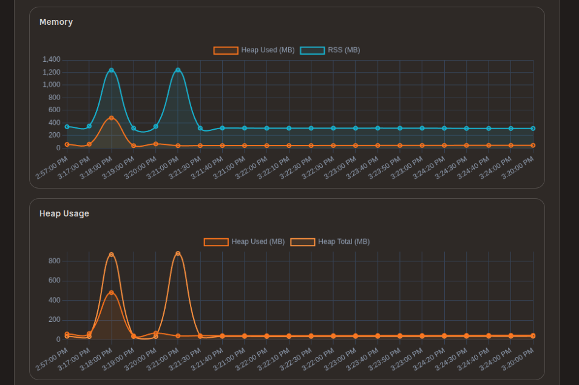

# Shokupan 🍞

> A delightful, type-safe web framework for Bun

**Built for Developer Experience**
Shokupan is designed to make building APIs delightful again. With zero-config defaults, instant startup times, and full type safety out of the box, you can focus on building your product, not configuring your framework.

> [!CAUTION]
> Shokupan is still in alpha and is not guaranteed to be stable. Please use with caution. We will be adding more features and APIs in the future. Please file an issue if you find any bugs or have suggestions for improvement.

📚 **[Full documentation available at https://shokupan.dev](https://shokupan.dev)**

## ✨ Features

- 🎯 **TypeScript First** - End-to-end type safety with decorators and generics. No manual types needed.
- 🛠️ **Zero Config** - Works effectively out of the box. No complex setup or boilerplate.
- 🚀 **Built for Bun** - Native [Bun](https://bun.sh/) performance with instant startup.
- 🔍 **Debug Dashboard** - Visual inspector for your routes, middleware, and request flow.
- 📝 **Auto OpenAPI** - Generate [OpenAPI](https://www.openapis.org/) specs automatically from routes.
- 🔌 **Rich Plugin System** - CORS, Sessions, Auth, Validation, Rate Limiting, and more.
- 🌐 **Flexible Routing** - Express-style routes or decorator-based controllers.
- 🔀 **Express Compatible** - Works with [Express](https://expressjs.com/) middleware patterns.
- 📊 **Built-in Telemetry** - [OpenTelemetry](https://opentelemetry.io/) instrumentation out of the box.
- 🔐 **OAuth2 Support** - GitHub, Google, Microsoft, Apple, Auth0, Okta.
- ✅ **Multi-validator Support** - Zod, Ajv, TypeBox, Valibot.
- 📚 **OpenAPI Docs** - Beautiful OpenAPI documentation with [Scalar](https://scalar.dev/).
- ⏩ **Short shift** - Very simple migration from [Express](https://expressjs.com/) or [NestJS](https://nestjs.com/) to Shokupan.




## 🚀 Quick Start

> Bun and TypeScript are recommended for Shokupan, though it also supports Node.js and standard JavaScript.

```typescript
import { Shokupan, ScalarPlugin } from 'shokupan';
const app = new Shokupan();

app.get('/', (ctx) => ({ message: 'Hello, World!' }));
app.get('/hello', (ctx) => "world");

app.mount('/scalar', new ScalarPlugin({
    enableStaticAnalysis: true
}));

app.listen();
```

That's it! Your server is running at `http://localhost:3000` 🎉

## 💡 Core Concepts

Shokupan provides a familiar yet modern API.

- **[Routing](https://shokupan.dev/core/routing)**: Express-style routing (`app.get`, `app.post`) with a clean, intuitive API.
- **[Controllers](https://shokupan.dev/core/controllers)**: Decorator-based controllers (`@Controller`, `@Get`) for structured applications.
- **[Middleware](https://shokupan.dev/core/middleware)**: Koa-style async middleware for request processing and flow control.
- **[Context](https://shokupan.dev/core/context)**: A rich `ctx` object containing request, response, parameters, and shared state.
- **[Static Files](https://shokupan.dev/core/static-files)**: Serve static assets with ease.
- **[WebSockets](https://shokupan.dev/core/websockets)**: Native WebSocket handling and HTTP Bridge feature.

## 🔌 Plugins

Shokupan has a rich ecosystem of plugins.

| Plugin | Description |
| :--- | :--- |
| **[Dashboard](https://shokupan.dev/plugins/dashboard)** | Visual dashboard for debugging and analysis. |
| **[Error View](https://shokupan.dev/plugins/error-view)** | Beautiful, interactive error pages for development. |
| **[CORS](https://shokupan.dev/plugins/cors)** | Configure Cross-Origin Resource Sharing. |
| **[Compression](https://shokupan.dev/plugins/compression)** | Enable response compression (gzip, deflate, etc.). |
| **[Rate Limiting](https://shokupan.dev/plugins/rate-limiting)** | Protect your API from abuse. |
| **[Security Headers](https://shokupan.dev/plugins/security-headers)** | Add essential security headers (CSP, HSTS, etc.). |
| **[Sessions](https://shokupan.dev/plugins/sessions)** | Session management with connect-style store support. |
| **[Authentication](https://shokupan.dev/plugins/authentication)** | Built-in OAuth2 support (GitHub, Google, etc.). |
| **[Validation](https://shokupan.dev/plugins/validation)** | Validate requests with Zod, Ajv, TypeBox, or Valibot. |
| **[Scalar (OpenAPI)](https://shokupan.dev/plugins/scalar)** | Beautiful, interactive API documentation. |
| **[API Explorer](https://shokupan.dev/plugins/api-explorer)** | Built-in interactive documentation for your API. |
| **[AsyncAPI](https://shokupan.dev/plugins/asyncapi)** | Generate and view documentation for WebSocket APIs. |
| **[Cluster](https://shokupan.dev/plugins/cluster)** | Utilize multiple CPU cores for better performance. |
| **[GraphQL](https://shokupan.dev/plugins/graphql)** | Support for Apollo Server and GraphQL Yoga. |
| **[HTTP Server](https://shokupan.dev/plugins/http-server)** | Use standard Node.js HTTP/HTTPS servers. |
| **[MCP Server](https://shokupan.dev/plugins/mcp-server)** | Expose your API as tools to LLMs. |
| **[Socket.IO](https://shokupan.dev/plugins/socket-io)** | Easy integration with Socket.IO. |
| **[Proxy](https://shokupan.dev/plugins/proxy)** | Create reverse proxies. |
| **[OpenAPI Validator](https://shokupan.dev/plugins/openapi-validation)** | Validate requests against OpenAPI specs. |
| **[Idempotency](https://shokupan.dev/plugins/idempotency)** | Ensure safe retries for non-idempotent operations. |

## 🚀 Advanced Features

- **[Dependency Injection](https://shokupan.dev/guides/advanced)**: Built-in container for managing dependencies.
- **[OpenAPI Generation](https://shokupan.dev/core/controllers)**: Auto-generate specs from your code.
- **[Sub-Requests](https://shokupan.dev/core/routing)**: Make internal requests without HTTP overhead.
- **[OpenTelemetry](https://shokupan.dev/guides/production)**: Built-in distributed tracing.
- **[Type Augmentation](https://shokupan.dev/guides/global-type-augmentation)**: Extend global types for type-safety.

## 📚 Guides & Reference

- **[Migration Guides](https://shokupan.dev/migration)**: Detailed guides for migrating from Express, Koa, or NestJS.
- **[Testing](https://shokupan.dev/guides/testing)**: How to test your Shokupan application.
- **[Deployment](https://shokupan.dev/guides/deployment)**: Deploying to Bun, Docker, and more.
- **[CLI Reference](https://shokupan.dev/guides/cli)**: Documentation for the Shokupan CLI.
- **[API Reference](https://shokupan.dev/api)**: Complete API documentation.
- **[Roadmap](https://shokupan.dev/reference/roadmap)**: Future plans and features.

## 🤝 Contributing

Contributions are welcome! Please feel free to submit a Pull Request.

1. Fork the repository
2. Create your feature branch (`git checkout -b feature/amazing-feature`)
3. Commit your changes (`git commit -m 'Add some amazing feature'`)
4. Publish the branch (`git push origin feature/amazing-feature`)
5. Open a Pull Request

## 📝 License

MIT License - see the [LICENSE](LICENSE) file for details.

## 🙏 Acknowledgments

- Inspired by [Express](https://expressjs.com/), [Koa](https://koajs.com/), [NestJS](https://nestjs.com/), and [Elysia](https://elysiajs.com/)
- Built for the amazing [Bun](https://bun.sh/) runtime
- Powered by [Arctic](https://github.com/pilcrowonpaper/arctic) for OAuth2 support
- Tests and Benchmarks created with Antigravity

---

**Made with ❤️ by the Shokupan team**
