The `Dashboard` provides a visual interface to inspect your running application. It allows you to:

- View real-time metrics (requests/sec, errors, latency).
- Visualize the endpoint layout and request flow.
- Debug requests with Chrome DevTools inspired interface.
- Directly test HTTP APIs with custom REST API explorer.
- Directly test WebSocket APIs with custom WebSocket explorer.

> Shokupan includes a built-in Dashboard plugin:

## Stats 

Showing Requests/Second and CPU Usage
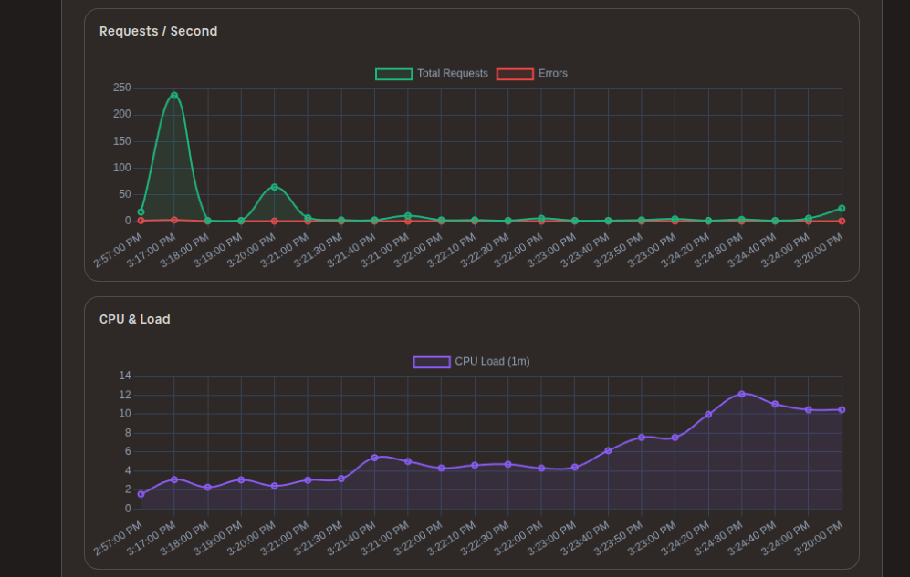
Showing Memory and Heap usage

Showing Event loop latency and Error rate
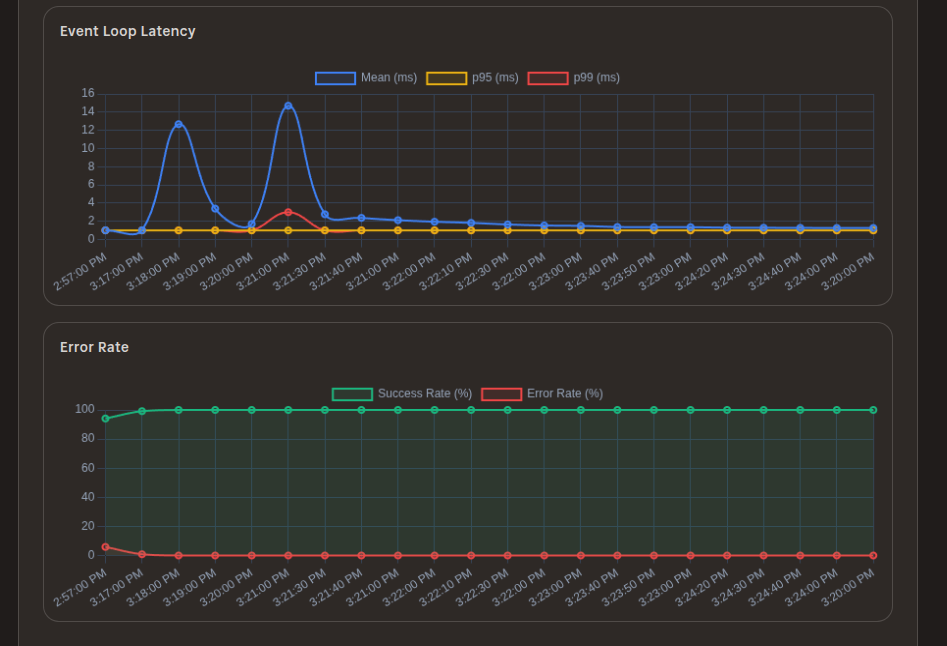

## Application Structure 
:::tip[Did you know?]
Shokupan reads your source code and generates an AST of your code, then it can provide a visual representation of the application's structure, including routers, controllers, and middleware.
This process is done either during startup or in your CI/CD pipeline, allowing you to write an application without managing DTOs or manually documenting your API.
:::

Application registry -- a tree view of your application's structure and registered routes.
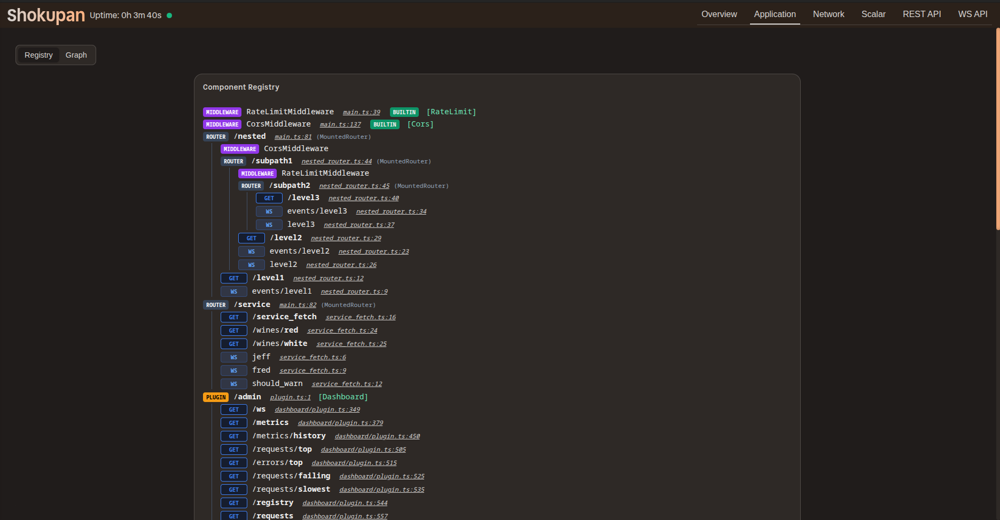

Application graph -- a 2D graph view of your application's structure and registered routes.
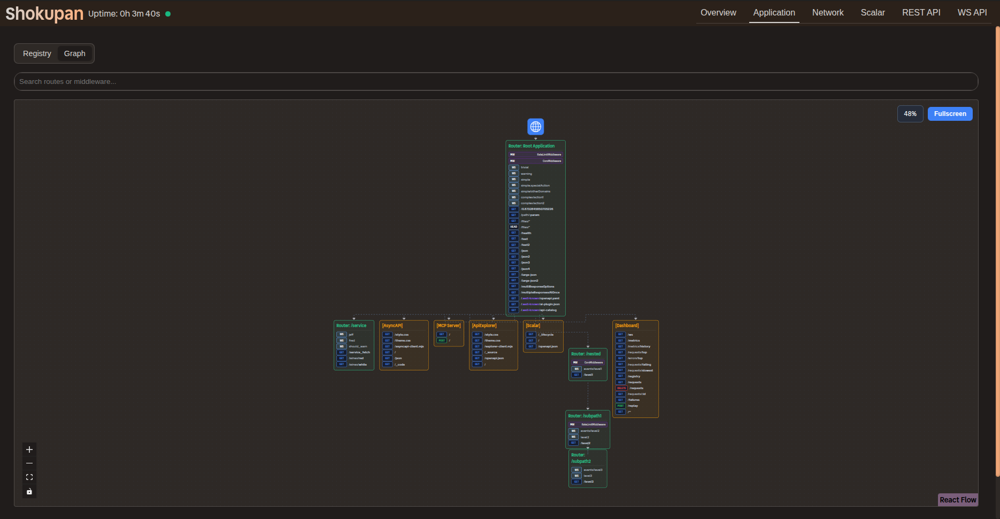
Zoomed in view of application graph -- showing node level details.
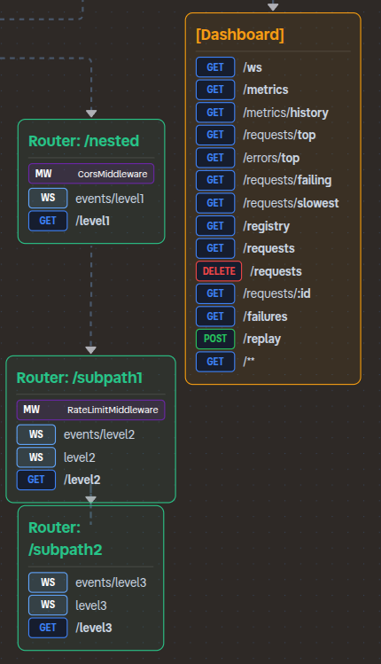

## Network Requests 
Network overview: A Chrome DevTools inspired interface for inspecting network requests.
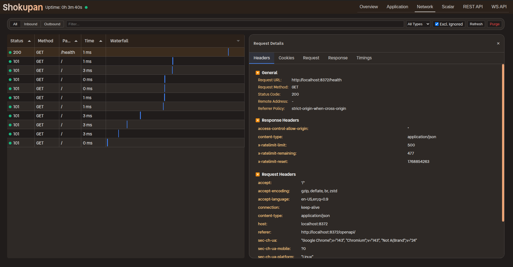
Timings: Inspired by Chrome DevTools, Shokupan records middleware timings provides a clear breakdown.
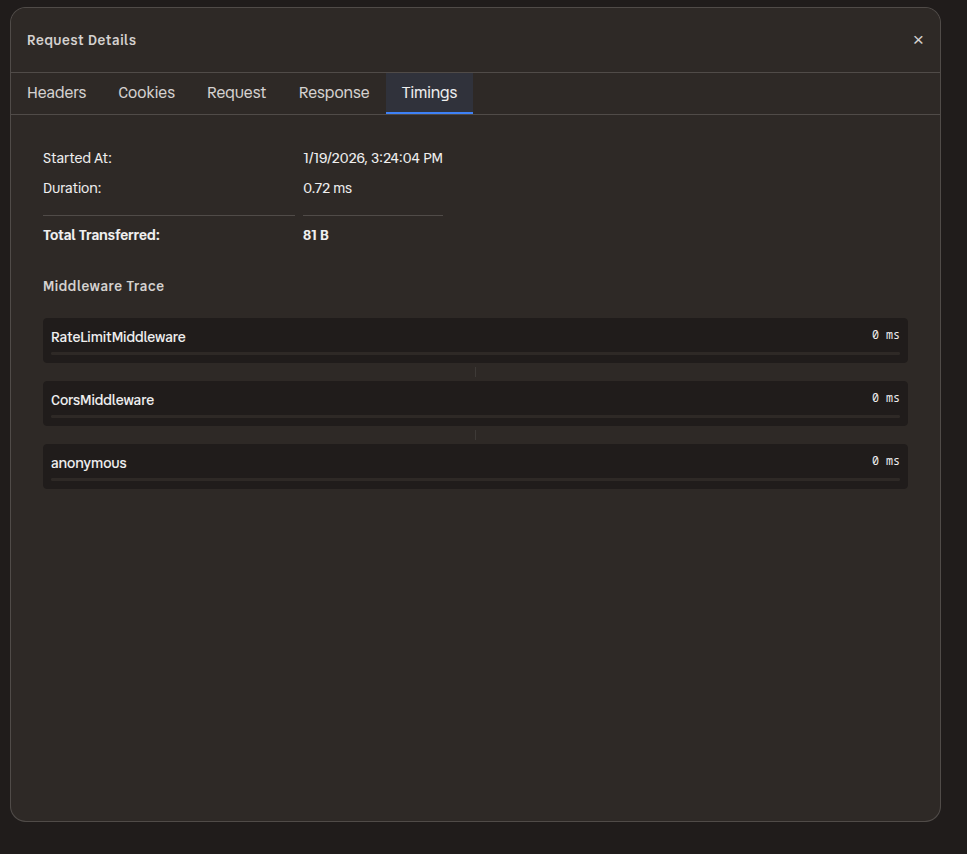

:::note
Shokupan records both incoming AND outgoing requests, allowing you to inspect the full request flow and directly replay requests from the dashboard.
:::

## API Explorer
API Explorer: A Scalar inspired interface for inspecting and testing REST APIs. It has specialized support in order to present warnings where metadata could not be statically determined.
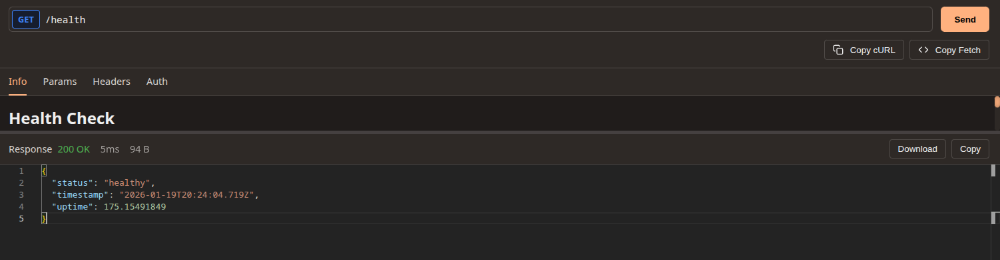
Multi-response: Shokupan can document multiple responses formats for a single request.
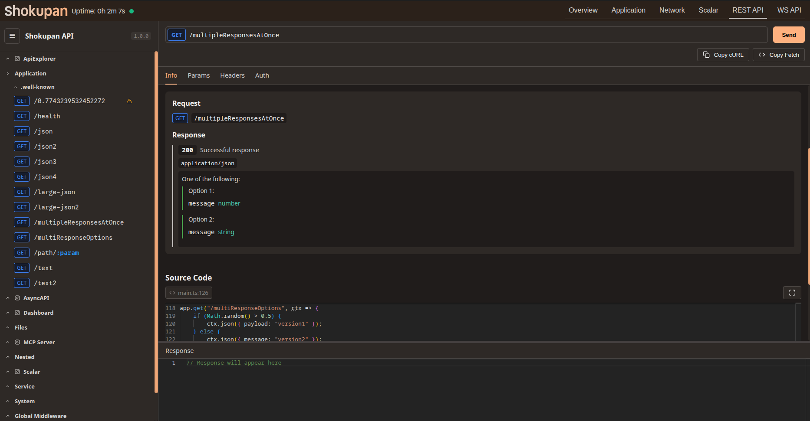
Middleware: Documentation for which endpoints a middleware applies to, as well as the configuration and side-effects of the middleware.
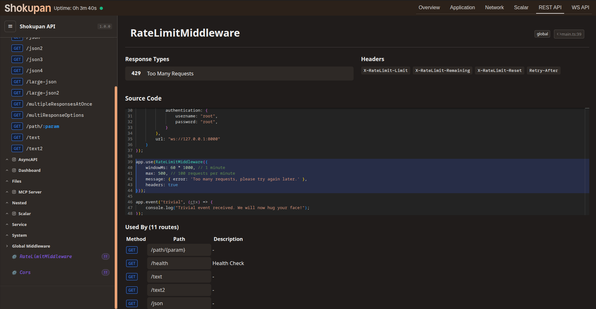
WS Explorer: A Hoppscotch inspired interface for inspecting and testing WebSocket APIs.
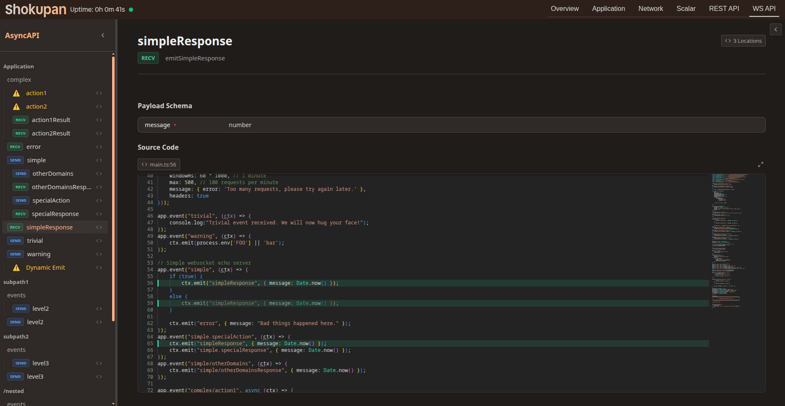
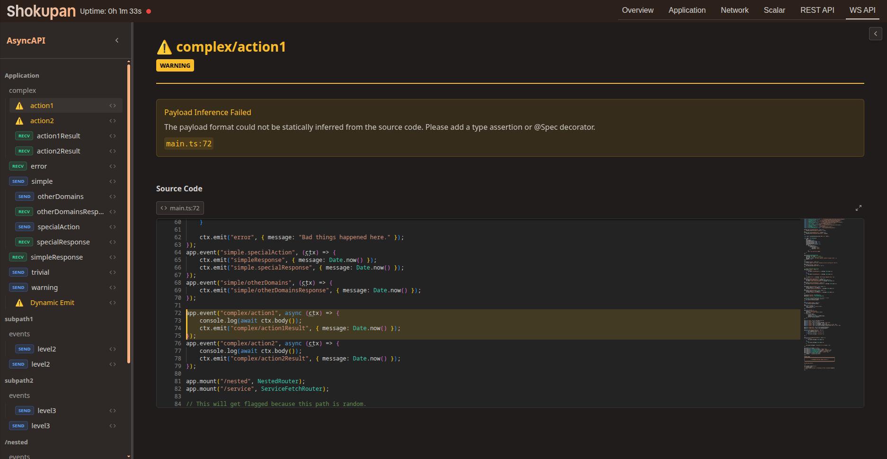

## Installation

```typescript
import { Dashboard } from 'shokupan';

// Mount the dashboard at a path of your choice
app.mount('/debug', new Dashboard({
    retentionMs: 7200000 // Keep logs for 2 hours
}));
```

## Configuration
import DashboardConfig from '../api/interfaces/DashboardConfig.md';

> <DashboardConfig />

## Features

### Middleware Graph
Visualizes the structure of your application, showing how routers, controllers, and middleware are connected.


### Component Registry
Inspect all registered routes and controllers in a flat or hierarchical view.


### Requests View
Analyze incoming requests, their duration, and the time spent in each middleware.


### Failed Requests
Lists requests that resulted in errors. You can click on a failure to see details and replay it.

### Playback
Replaying a request sends the identical request payload to the server again, which is useful for debugging idempotent operations or testing fixes.
