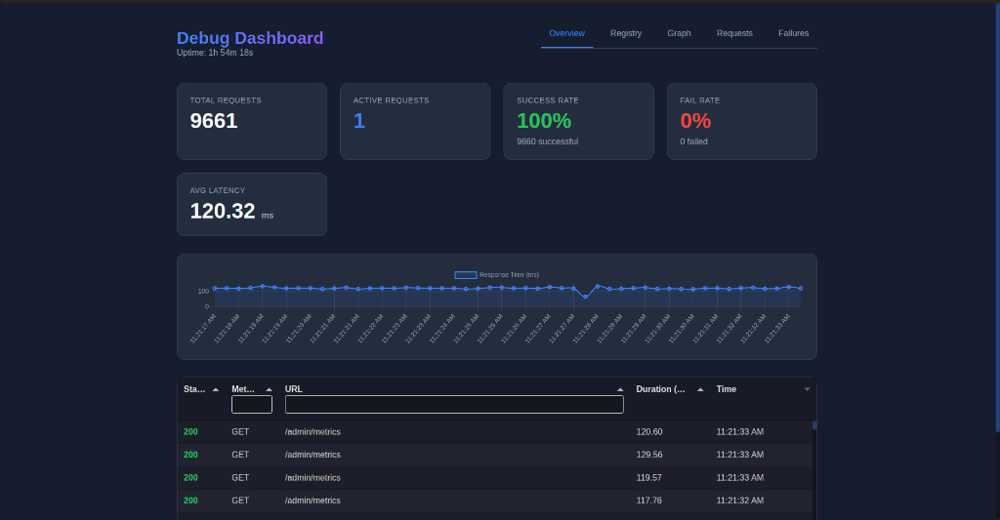
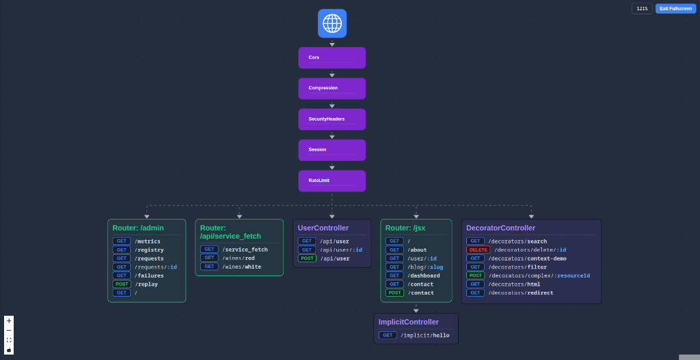
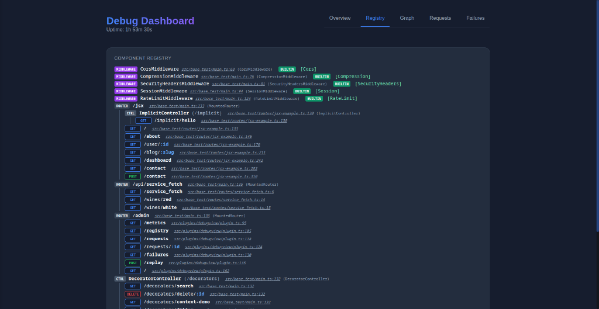
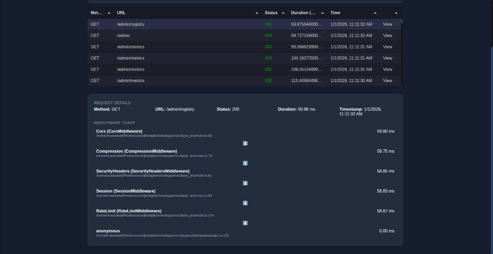

The `Dashboard` provides a visual interface to inspect your running application. It allows you to:

- View real-time metrics (requests/sec, errors, latency).
- Visualize the middleware graph and request flow.
- Inspect the component registry (controllers, routes).
- View middleware execution logs if `enableMiddlewareTracking` is on.
- Inspect and replay failed requests captured by `FailedRequestRecorder`.



## Installation

```typescript
import { Dashboard } from 'shokupan';

// Mount the dashboard at a path of your choice
app.mount('/debug', new Dashboard({
    retentionMs: 7200000 // Keep logs for 2 hours
}));
```

## Configuration

| Option | Type | Description |
| :--- | :--- | :--- |
| `retentionMs` | `number` | How long to keep in-memory metrics and logs (ms). |
| `getRequestHeaders` | `() => Record<string, string>` | Hook to provide custom headers (e.g. auth tokens) when replaying requests from the dashboard. |

## Features

### Middleware Graph
Visualizes the structure of your application, showing how routers, controllers, and middleware are connected.



### Component Registry
Inspect all registered routes and controllers in a flat or hierarchical view.



### Requests View
Analyze incoming requests, their duration, and the time spent in each middleware.



### Failed Requests
Lists requests that resulted in errors. You can click on a failure to see details and replay it.

### Playback
Replaying a request sends the identical request payload to the server again, which is useful for debugging idempotent operations or testing fixes.
