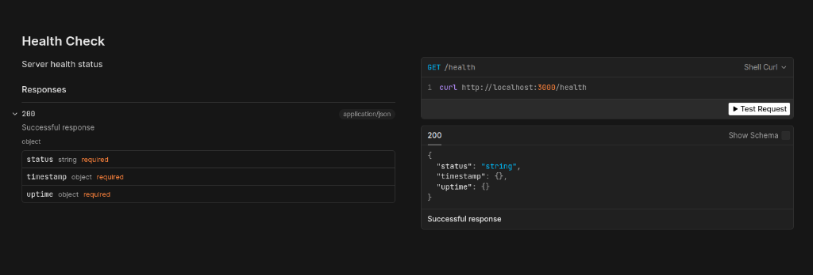

The Scalar plugin provides beautiful, interactive OpenAPI (Swagger) documentation for your API.

## Quick Start

```typescript
import { Shokupan, ScalarPlugin } from 'shokupan';

const app = new Shokupan();

app.mount('/docs', new ScalarPlugin({
    baseDocument: {
        info: {
            title: 'My API',
            version: '1.0.0',
            description: 'API documentation for my application'
        }
    },
    config: {
        theme: 'purple',
        layout: 'modern'
    }
}));

app.listen();
// Documentation available at: http://localhost:3000/docs
```




## Configuration

```typescript
app.mount('/docs', new ScalarPlugin({
    baseDocument: {
        info: {
            title: 'My API',
            version: '1.0.0',
            description: 'Comprehensive API documentation',
            contact: {
                name: 'API Support',
                email: 'support@example.com',
                url: 'https://example.com/support'
            },
            license: {
                name: 'MIT',
                url: 'https://opensource.org/licenses/MIT'
            }
        },
        servers: [
            {
                url: 'https://api.example.com',
                description: 'Production server'
            },
            {
                url: 'https://staging-api.example.com',
                description: 'Staging server'
            },
            {
                url: 'http://localhost:3000',
                description: 'Development server'
            }
        ]
    },
    config: {
        theme: 'purple',      // 'purple', 'blue', 'green', etc.
        layout: 'modern',     // 'modern' or 'classic'
        showSidebar: true,
        hideDownloadButton: false
    },
    
    // Mount path (default: '/reference' or '/docs' if mounted manually)
    path: '/reference',

    // Enable eager static analysis of entrypoint (TypeScript only)
    enableStaticAnalysis: true
}));
```

## Automatic OpenAPI Generation

Shokupan automatically generates fully-featured OpenAPI specs from your routes, DTOs, and controllers through powerful Abstract Syntax Tree (AST) analysis. The Scalar plugin leverages this deeply-analyzed specification to hydrate its beautiful interactive UI out of the box.

> [!TIP]
> While AST analysis guarantees zero-configuration documentation, it can affect cold start performance in massive projects. Read the **[AST Generation Guide](/guides/ast-generation/)** to learn how to pre-compile this static mapping during your CI workflow in a single CLI command!

You can further enhance your routes with manual metadata overrides:

```typescript
app.get('/users/:id', {
    summary: 'Get user by ID',
    description: 'Retrieves a single user by their unique identifier',
    tags: ['Users'],
    parameters: [{
        name: 'id',
        in: 'path',
        required: true,
        schema: { type: 'string' },
        description: 'User ID'
    }],
    responses: {
        200: {
            description: 'User found',
            content: {
                'application/json': {
                    schema: {
                        type: 'object',
                        properties: {
                            id: { type: 'string' },
                            name: { type: 'string' },
                            email: { type: 'string' }
                        }
                    }
                }
            }
        },
        404: {
            description: 'User not found'
        }
    }
}, (ctx) => {
    return { id: ctx.params.id, name: 'Alice', email: 'alice@example.com' };
});
```

## Themes

Available themes:
- `purple` (default)
- `blue`
- `green`
- `red`
- `orange`
- `yellow`
- `dark`
- `light`

```typescript
config: {
    theme: 'blue'
}
```

## Security

Add authentication to your docs in production:

```typescript
const docsAuth = async (ctx, next) => {
    // Basic auth for docs
    const auth = ctx.headers.get('authorization');
    
    if (!auth || !validateDocsAuth(auth)) {
        ctx.set('WWW-Authenticate', 'Basic realm="Documentation"');
        return ctx.status(401);
    }
    
    return next();
};

if (process.env.NODE_ENV === 'production') {
    app.use('/docs', docsAuth);
}

app.mount('/docs', new ScalarPlugin({...}));
```

## Next Steps

- [OpenAPI Generation](/advanced/openapi/) - Advanced OpenAPI features
- [Validation](/plugins/validation/) - Generate schemas from validators
- [Controllers](/core/controllers/) - Document controller endpoints
